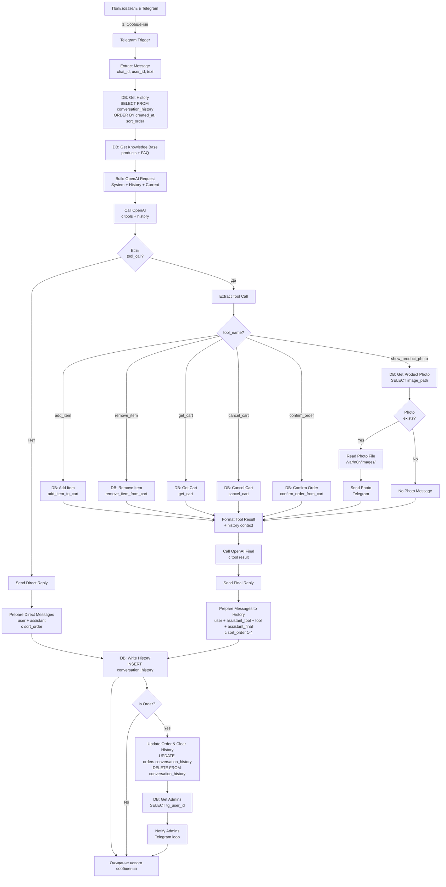

# Коммерческое предложение на разработку интернет-магазина с ИИ-консультантом в Telegram для корпоративного мерча TechFlow Solutions

## 1. Описание проекта

### 1.1. Цель проекта

Создание Telegram-бота с интеграцией искусственного интеллекта для автоматизации продаж корпоративного мерча компании TechFlow Solutions. Система обеспечивает естественное общение с клиентами через диалог на русском языке, помогает выбрать товары из каталога, управлять корзиной, оформлять заказы и автоматически уведомляет администраторов о новых заказах с полной историей диалога.

**Ключевые особенности:**

- Естественный диалог с клиентами через GPT-4o-mini без жёстких команд и кнопок
- Контекстная память разговоров — бот помнит всю историю диалога
- Автоматическое управление корзиной и заказами через PostgreSQL функции
- Полная история диалогов сохраняется в заказах для анализа
- Мгновенные уведомления администраторов в Telegram о новых заказах


### 1.2. Используемые технологии

| Технология | Назначение | Версия/Детали |
| :-- | :-- | :-- |
| **n8n** | Платформа автоматизации для построения workflow | Self-hosted / Cloud |
| **OpenAI API** | GPT-4o-mini для обработки естественного языка с function calling | gpt-4o-mini-2024-07-18 |
| **PostgreSQL** | Реляционная БД для хранения товаров, заказов, корзин, истории | PostgreSQL 14+ |
| **Telegram Bot API** | Взаимодействие с пользователями через Telegram | Webhook-based |
| **JavaScript/Node.js** | Бизнес-логика в n8n Code nodes | ES6+ |

### 1.3. Среда для разворачивания

- **n8n Workflow Platform**: облачная или self-hosted версия (DigitalOcean, AWS, VPS)
- **PostgreSQL Database**: база данных для хранения всех данных (managed или self-hosted)
- **Telegram Bot**: регистрация через BotFather, webhook для приёма сообщений
- **File Storage**: локальное хранилище для изображений товаров (`/var/n8n/images/`)
- **OpenAI API Key**: для доступа к GPT-4o-mini

***

## 2. Архитектура и схема работы системы

### 2.1. Общая архитектура

Система построена на основе event-driven архитектуры с использованием n8n workflow:

```
[Пользователь Telegram] 
    ↓
[Telegram Bot API (Webhook)] 
    ↓
[n8n Workflow]
    ├── Извлечение данных сообщения
    ├── Загрузка истории диалога (PostgreSQL)
    ├── Загрузка базы знаний (Products + FAQ)
    ├── Формирование запроса к OpenAI
    ↓
[OpenAI GPT-4o-mini + Function Calling]
    ↓
[Routing функций]
    ├── add_item → PostgreSQL function
    ├── remove_item → PostgreSQL function
    ├── get_cart → PostgreSQL function
    ├── confirm_order → PostgreSQL function
    ├── cancel_cart → PostgreSQL function
    ├── show_product_photo → File System
    ↓
[Формирование финального ответа]
    ↓
[Отправка в Telegram + Сохранение истории]
    ↓
[Уведомление администраторов (если заказ)]
```


### 2.2. Детальная диаграмма взаимодействия




***

## 3. Структура базы данных PostgreSQL

> **Примечание:** Полный SQL-код для создания таблиц и функций доступен в файле `TechFlow-Merch-Store-Complete-AI-Assistant-v2.2.1.json` (секция PostgreSQL nodes) и в документации проекта.

### 3.1. Схема таблиц

#### Таблица `categories` — Категории товаров

| Поле | Тип | Описание |
| :-- | :-- | :-- |
| `id` | VARCHAR(50) PRIMARY KEY | Уникальный идентификатор категории (например, `apparel`) |
| `name` | VARCHAR(100) | Название категории (например, "Одежда") |
| `sort_order` | INTEGER | Порядок сортировки для отображения |

**Назначение:** Хранение категорий товаров для группировки в каталоге и удобной навигации пользователей.

#### Таблица `products` — Каталог товаров

| Поле | Тип | Описание |
| :-- | :-- | :-- |
| `id` | VARCHAR(50) PRIMARY KEY | Уникальный идентификатор товара (например, `hoodie_navy`) |
| `name` | VARCHAR(200) | Название товара |
| `category_id` | VARCHAR(50) REFERENCES categories(id) | Связь с категорией |
| `price` | DECIMAL(10,2) | Цена в рублях |
| `description` | TEXT | Подробное описание товара |
| `image_path` | VARCHAR(500) | Путь к изображению товара |
| `is_active` | BOOLEAN DEFAULT TRUE | Флаг активности товара |
| `created_at` | TIMESTAMP DEFAULT NOW() | Дата создания |

**Назначение:** Основной каталог товаров с описаниями, ценами и фотографиями. Поле `is_active` позволяет скрывать товары без удаления из базы.

#### Таблица `carts` — Корзины пользователей

| Поле | Тип | Описание |
| :-- | :-- | :-- |
| `user_id` | BIGINT | Telegram user_id |
| `product_id` | VARCHAR(50) REFERENCES products(id) | ID товара в корзине |
| `quantity` | INTEGER DEFAULT 1 | Количество единиц товара |
| `added_at` | TIMESTAMP DEFAULT NOW() | Время добавления |
| PRIMARY KEY | (user_id, product_id) | Композитный ключ |

**Назначение:** Временное хранение корзины каждого пользователя. Композитный ключ по `user_id` и `product_id` предотвращает дублирование товаров в корзине одного пользователя.

#### Таблица `orders` — Оформленные заказы

| Поле | Тип | Описание |
| :-- | :-- | :-- |
| `order_no` | VARCHAR(50) PRIMARY KEY | Уникальный номер заказа (например, `MERCH-20251029-0005`) |
| `user_id` | BIGINT | Telegram user_id покупателя |
| `phone` | VARCHAR(20) | Телефон для связи |
| `address` | TEXT | Адрес доставки |
| `total_amount` | DECIMAL(10,2) | Общая сумма заказа |
| `status` | VARCHAR(20) DEFAULT 'confirmed' | Статус заказа |
| `conversation_history` | JSONB | Полная история диалога с клиентом |
| `created_at` | TIMESTAMP DEFAULT NOW() | Дата создания заказа |

**Назначение:** Хранение всех оформленных заказов. Поле `conversation_history` (JSONB) содержит полную историю общения с клиентом для анализа и разрешения спорных ситуаций.

#### Таблица `order_items` — Состав заказов

| Поле | Тип | Описание |
| :-- | :-- | :-- |
| `order_no` | VARCHAR(50) REFERENCES orders(order_no) | Номер заказа |
| `product_id` | VARCHAR(50) | ID товара |
| `product_name` | VARCHAR(200) | Название товара на момент заказа |
| `quantity` | INTEGER | Количество |
| `price` | DECIMAL(10,2) | Цена на момент заказа |
| PRIMARY KEY | (order_no, product_id) | Композитный ключ |

**Назначение:** Детализация состава каждого заказа. Хранение названия и цены товара на момент заказа обеспечивает исторические данные даже при изменении каталога.

#### Таблица `conversation_history` — История диалогов

| Поле | Тип | Описание |
| :-- | :-- | :-- |
| `id` | SERIAL PRIMARY KEY | Автоинкрементный ID |
| `chat_id` | BIGINT | Telegram chat_id |
| `user_id` | BIGINT | Telegram user_id |
| `role` | VARCHAR(20) | Роль: `user`, `assistant`, `tool` |
| `content` | TEXT | Текст сообщения |
| `tool_calls` | JSONB | JSON с вызовами функций (для assistant) |
| `tool_call_id` | VARCHAR(100) | ID вызова функции (для tool) |
| `sort_order` | INTEGER DEFAULT 1 | Порядок сообщений в рамках одного взаимодействия |
| `created_at` | TIMESTAMP DEFAULT NOW() | Время создания |

**Назначение:** Хранение всей истории диалогов для восстановления контекста при новых сообщениях пользователя. Поле `sort_order` обеспечивает правильный порядок сообщений при взаимодействии с OpenAI (user → assistant_tool → tool → assistant_final).

#### Таблица `admins` — Администраторы для уведомлений

| Поле | Тип | Описание |
| :-- | :-- | :-- |
| `tg_user_id` | BIGINT PRIMARY KEY | Telegram user_id администратора |
| `name` | VARCHAR(100) | Имя администратора |
| `role` | VARCHAR(50) | Роль (например, "Менеджер по мерчу") |
| `is_active` | BOOLEAN DEFAULT TRUE | Флаг активности для уведомлений |

**Назначение:** Список администраторов, которые получают уведомления о новых заказах в Telegram. Поле `is_active` позволяет временно отключить уведомления для конкретного администратора.

#### Таблица `faq` — База знаний (FAQ)

| Поле | Тип | Описание |
| :-- | :-- | :-- |
| `id` | SERIAL PRIMARY KEY | Автоинкрементный ID |
| `question` | TEXT | Вопрос |
| `answer` | TEXT | Ответ |
| `sort_order` | INTEGER | Порядок сортировки |

**Назначение:** Хранение часто задаваемых вопросов и ответов для формирования базы знаний в системном промпте OpenAI.

***

### 3.2. PostgreSQL функции для работы с корзиной и заказами

> **Примечание:** Полный код функций доступен в файле `TechFlow-Merch-Store-Complete-AI-Assistant-v2.2.1.json` и в документации проекта `diagramma.-tablitsy-sostoianii-i-perekhodov.md`.

#### Функция `add_item_to_cart(p_user_id, p_product_id, p_qty)`

**Назначение:** Добавить товар в корзину пользователя или увеличить количество, если товар уже есть.

**Что делает:**

1. Проверяет существование товара в таблице `products` и его активность (`is_active = TRUE`)
2. Если товар не найден или неактивен, выбрасывает исключение `'Товар не найден или неактивен'`
3. Добавляет товар в таблицу `carts` или увеличивает количество при конфликте ключа
4. Возвращает JSON с информацией о добавленном товаре: статус, сообщение, название, количество, цена

**Возвращаемые данные:** `{"status": "success", "message": "Товар добавлен", "product_name": "...", "quantity": 2, "price": 1400.00}`

#### Функция `remove_item_from_cart(p_user_id, p_product_id)`

**Назначение:** Удалить товар из корзины пользователя.

**Что делает:**

1. Удаляет запись из таблицы `carts` по `user_id` и `product_id`
2. Проверяет количество удалённых строк
3. Если удалено 0 строк, возвращает статус `'not_found'` с сообщением `'Этого товара нет в вашей корзине'`
4. Если удаление успешно, возвращает статус `'success'`

**Возвращаемые данные:** `{"status": "success", "message": "Товар удалён из корзины"}` или `{"status": "not_found", "message": "..."}`

#### Функция `get_cart(p_user_id)`

**Назначение:** Получить содержимое корзины пользователя с расчётом итоговой суммы.

**Что делает:**

1. Выполняет JOIN таблиц `carts` и `products` для получения полной информации о товарах в корзине
2. Формирует JSON-массив с товарами: ID, название, количество, цена за единицу, промежуточная сумма
3. Рассчитывает общую сумму корзины через `SUM(c.quantity * p.price)`
4. Если корзина пуста, возвращает статус `'empty'` с пустым массивом товаров

**Возвращаемые данные:** `{"status": "success", "items": [{...}, {...}], "total": 2600.00}` или `{"status": "empty", "message": "Ваша корзина пуста", "items": [], "total": 0}`

#### Функция `confirm_order_from_cart(p_user_id, p_phone, p_address)`

**Назначение:** Оформить заказ из корзины, создать запись в `orders` и `order_items`, очистить корзину.

**Что делает:**

1. Проверяет наличие товаров в корзине пользователя через `COUNT(*)`
2. Если корзина пуста, выбрасывает исключение `'Корзина пуста. Невозможно оформить заказ'`
3. Генерирует уникальный номер заказа в формате `MERCH-YYYYMMDD-XXXX` с использованием sequence
4. Рассчитывает общую сумму заказа через JOIN с таблицей `products`
5. Создаёт запись в таблице `orders` со статусом `'confirmed'`
6. Копирует все товары из корзины в таблицу `order_items` с текущими названиями и ценами
7. Удаляет все товары из корзины пользователя
8. Возвращает JSON с номером заказа и итоговой суммой

**Возвращаемые данные:** `{"status": "success", "order_no": "MERCH-20251029-0005", "total": 2600.00, "message": "Заказ успешно оформлен!"}`

#### Функция `cancel_cart(p_user_id)`

**Назначение:** Очистить корзину пользователя без оформления заказа.

**Что делает:**

1. Удаляет все записи из таблицы `carts` для данного `user_id`
2. Возвращает JSON со статусом успешного выполнения

**Возвращаемые данные:** `{"status": "success", "message": "Ваша корзина очищена"}`

***

## 4. Интеграция с OpenAI API

> **Примечание:** Полные примеры запросов и ответов доступны в файлах `n8n - пример подготовки промпта для OpenAI.json` и `n8n - пример ответа из OpenAI с командой.json`.

### 4.1. Системный промпт и база знаний

Система использует динамический системный промпт, который формируется из трёх частей перед каждым запросом к OpenAI:

**Компоненты промпта:**

1. **Роль и инструкции:** Определяет роль ИИ-консультанта магазина корпоративного мерча компании TechFlow Solutions с правилами поведения и взаимодействия с клиентами
2. **Каталог товаров:** Полный список актуальных товаров из базы данных (SELECT из таблиц `products` JOIN `categories`) в формате JSON с полями: id, name, category, price, description
3. **База знаний FAQ:** Ответы на часто задаваемые вопросы из таблицы `faq`: способы оплаты, условия доставки, политика возврата, скидки для корпоративных клиентов, таблица размеров

**Инструкции для ИИ:**

- Отвечать на вопросы о товарах из каталога
- Использовать FAQ для ответов об оплате, доставке, возврате
- Применять функции для работы с корзиной
- При первом контакте представиться и рассказать о возможностях
- Не выдавать весь список товаров сразу — сначала показать категории
- Быть вежливым и кратким
- Игнорировать информацию, не относящуюся к процессу продажи

**Примечание:** Каталог товаров и FAQ загружаются из PostgreSQL перед каждым запросом к OpenAI, обеспечивая актуальность информации.

### 4.2. Function Calling — Доступные функции

OpenAI получает набор из 6 функций для управления корзиной и заказами:

#### 1. Функция `add_item` — Добавить товар в корзину

**Параметры:**

- `product_id` (string, обязательный) — ID товара из каталога
- `qty` (integer, обязательный, minimum: 1) — Количество единиц товара

**Описание:** Добавляет товар в корзину пользователя с указанным количеством.

#### 2. Функция `remove_item` — Удалить товар из корзины

**Параметры:**

- `product_id` (string, обязательный) — ID товара для удаления

**Описание:** Полностью удаляет товар из корзины пользователя.

#### 3. Функция `get_cart` — Показать корзину

**Параметры:** Нет параметров

**Описание:** Возвращает текущее содержимое корзины пользователя с итоговой суммой.

#### 4. Функция `confirm_order` — Оформить заказ

**Параметры:**

- `phone` (string, обязательный) — Номер телефона для связи
- `address` (string, обязательный) — Адрес доставки

**Описание:** Оформляет заказ из текущей корзины с указанными контактными данными.

#### 5. Функция `cancel_cart` — Очистить корзину

**Параметры:** Нет параметров

**Описание:** Полностью очищает корзину пользователя без оформления заказа.

#### 6. Функция `show_product_photo` — Показать фото товара

**Параметры:**

- `product_id` (string, обязательный) — ID товара для отображения фото

**Описание:** Отправляет изображение товара в чат Telegram.

### 4.3. Пример структуры запроса к OpenAI

**Запрос к OpenAI содержит:**

1. **model:** `"gpt-4o-mini"` — используемая модель OpenAI
2. **messages:** Массив сообщений с ролями `system`, `user`, `assistant`, `tool`
    - Первое сообщение: системный промпт с инструкциями, каталогом и FAQ
    - История диалога: все предыдущие сообщения пользователя и ответы ассистента
    - Текущее сообщение: новый запрос пользователя
3. **tools:** Массив из 6 доступных функций с описанием параметров
4. **tool_choice:** `"auto"` — OpenAI сам решает, нужно ли вызывать функцию


### 4.4. Пример структуры ответа от OpenAI с tool_call

**Когда OpenAI определяет необходимость вызова функции, ответ содержит:**

1. **id:** Уникальный идентификатор запроса (например, `chatcmpl-CVytZeJfU1i5tKX2SFNCNVL4vf8iA`)
2. **model:** Использованная модель (например, `gpt-4o-mini-2024-07-18`)
3. **choices.message:**
    - `role`: `"assistant"`
    - `content`: `null` (при вызове функции)
    - `tool_calls`: Массив вызовов функций
        - `id`: Уникальный ID вызова функции
        - `type`: `"function"`
        - `function.name`: Имя функции (например, `confirm_order`)
        - `function.arguments`: JSON-строка с аргументами (например, `{"phone":"+79161234567","address":"доставка домой"}`)
4. **usage:** Статистика использования токенов
    - `prompt_tokens`: Количество токенов в запросе
    - `completion_tokens`: Количество токенов в ответе
    - `total_tokens`: Общее количество токенов


**Обработка ответа:**

- n8n извлекает `tool_calls` из ответа
- Вызывает соответствующую PostgreSQL функцию с переданными аргументами
- Отправляет результат выполнения функции обратно в OpenAI для формирования финального ответа пользователю
- Финальный ответ отправляется в Telegram и сохраняется в историю диалога

***

## 5. Таблица состояний диалоговой системы

| № | Текущее состояние | Действие / Триггер | Следующее состояние | Ответственная система | Описание / Edge-case |
| :-- | :-- | :-- | :-- | :-- | :-- |
| 1 | Начало диалога | Пользователь пишет в Telegram | Загрузка истории | Telegram → n8n | Первое сообщение от пользователя |
| 1a | Загрузка истории | SELECT из conversation_history | Ожидание запроса | n8n → PostgreSQL | Восстановление контекста предыдущих диалогов (если есть) |
| 2 | Ожидание запроса | Запрос о товарах / каталоге | Ответ из каталога | n8n → OpenAI → Telegram | ИИ описывает категории и товары из knowledge + история |
| 3 | Ожидание запроса | Вопрос из FAQ (оплата, доставка и т.д.) | Ответ из FAQ | n8n → OpenAI → Telegram | ИИ отвечает на основе встроенного знания из промпта |
| 4 | Ожидание запроса | «Добавь [товар]» → товар найден в products.is_active = TRUE | Добавление в корзину | n8n → OpenAI → PostgreSQL → Telegram | Товар добавлен в carts.items |
| 4a | Добавление в корзину | Ответ отправлен пользователю | Сохранение истории | n8n → Telegram → PostgreSQL | INSERT в conversation_history (user, assistant, tool, assistant_final) |
| 5 | Ожидание запроса | «Добавь [несуществующий товар]» или неактивный | Ошибка: товар не найден | n8n → PostgreSQL → OpenAI → Telegram | PostgreSQL: RAISE EXCEPTION → ИИ: «Такого товара нет в каталоге» |
| 6 | Ожидание запроса | «Покажи корзину» → корзина не пуста | Просмотр корзины | n8n → PostgreSQL → OpenAI → Telegram | Отображается список товаров, итоговая сумма |
| 7 | Ожидание запроса | «Покажи корзину» → корзина пуста | Корзина пуста | n8n → OpenAI → Telegram | ИИ: «Ваша корзина пуста. Хотите посмотреть каталог?» |
| 8 | Ожидание запроса | «Удали [товар]» → товар есть в корзине | Удаление из корзины | n8n → PostgreSQL → OpenAI → Telegram | Товар удалён, корзина обновлена |
| 9 | Ожидание запроса | «Удали [товар]» → товара нет в корзине | Ошибка: товар не в корзине | n8n → PostgreSQL → OpenAI → Telegram | PostgreSQL: no error, but item not found → ИИ: «Этого товара нет в вашей корзине» |
| 10 | Ожидание запроса | «Оформи заказ» → корзина не пуста | Подтверждение заказа | n8n → OpenAI → Telegram | ИИ: «Отлично! Укажите ваш телефон и адрес доставки.» → пользователь отправляет одним сообщением |
| 11 | Ожидание запроса | «Оформи заказ» → корзина пуста | Ошибка: пустая корзина | n8n → OpenAI → Telegram | ИИ: «Нельзя оформить пустой заказ. Сначала добавьте товары!» |
| 12 | Ожидание запроса | Пользователь отправил «телефон, адрес» после запроса | Заказ создан | n8n → PostgreSQL → Telegram | Вызов confirm_order_from_cart() → заказ в orders, корзина очищена |
| 12a | Заказ создан | Ответ отправлен пользователю | Сохранение полной истории | n8n → PostgreSQL | INSERT финального ответа в conversation_history |
| 12b | Сохранение полной истории | История записана в БД | Архивация истории | n8n → PostgreSQL | UPDATE orders SET conversation_history + DELETE FROM conversation_history |
| 13 | Ожидание запроса | Пользователь отправил некорректные данные (без телефона/адреса) | Повтор запроса | n8n → OpenAI → Telegram | ИИ: «Пожалуйста, укажите телефон и адрес в одном сообщении.» |
| 14 | Архивация истории | Заказ успешно сохранён с историей | Уведомление админу | n8n → PostgreSQL → Telegram | SELECT tg_user_id FROM admins → отправка уведомления каждому |
| 15 | Заказ создан | Ошибка при создании заказа (БД недоступна, дубль order_no) | Ошибка: заказ не создан | n8n → OpenAI → Telegram | ИИ: «Извините, временно не могу оформить заказ. Попробуйте позже.» |
| 16 | Любое состояние | Пользователь пишет вне контекста («Привет», «Как дела?») | Нейтральный ответ | n8n → OpenAI → Telegram | ИИ: «Привет! Я помогу вам с заказом мерча. Что вас интересует?» |
| 16a | Нейтральный ответ | Ответ отправлен | Сохранение истории | n8n → PostgreSQL | INSERT простого диалога (user + assistant) в conversation_history |
| 17 | Любое состояние | Повторное «Оформи заказ» после подтверждения | Корзина пуста | n8n → OpenAI → Telegram | См. №11 — корзина уже очищена |
| 18 | Ожидание запроса | «Отмени заказ» (до подтверждения) | Корзина очищена | n8n → PostgreSQL → OpenAI → Telegram | Вызов cancel_cart() → DELETE FROM carts → ИИ: «Ваш заказ отменён. Корзина пуста.» |
| 19 | Ожидание запроса | «Покажи [товар]» → товар найден | Отправка фото товара | n8n → PostgreSQL → Telegram | ИИ: «Вот фото товара:» → n8n отправляет photo по image_url |


***

## 6. Таблица реализации переходов

| № | Состояние из таблицы | Реализовано в системе | Примечание |
| :-- | :-- | :-- | :-- |
| 1-1a | Начало диалога + Загрузка истории | ✅ | SELECT FROM conversation_history WHERE chat_id = user → восстановление контекста |
| 1–3 | FAQ, каталог | ✅ | Через OpenAI + системный промпт с knowledge + история предыдущих сообщений |
| 4–5 | Добавление товара (+ ошибка) | ✅ | Функция add_item_to_cart(), обработка EXCEPTION |
| 4a | Сохранение истории после добавления | ✅ | INSERT в conversation_history (user, assistant with tool_calls, tool, assistant_final) с sort_order |
| 6–7 | Просмотр корзины | ✅ | Функция get_cart() |
| 8–9 | Удаление товара (+ ошибка) | ✅ | Функция remove_item_from_cart() |
| 10–13 | Оформление заказа | ✅ | Единый вызов confirm_order(phone, address), валидация в PostgreSQL |
| 12a-12b | Сохранение и архивация истории | ✅ | INSERT финального ответа → UPDATE orders.conversation_history → DELETE FROM conversation_history |
| 14 | Уведомление админу | ✅ | SELECT admins → цикл отправки в Telegram (после архивации истории) |
| 15 | Ошибка БД | ✅ | Обработка ошибок в n8n → человекочитаемый ответ от OpenAI |
| 16 | Вне контекста | ✅ | Нейтральный ответ от OpenAI |
| 16a | Сохранение простых диалогов | ✅ | INSERT в conversation_history (user + assistant) для контекстных ответов |
| 17–18 | Повтор/отмена | ✅ | Отмена через cancel_cart() — теперь обязательная функция |
| 19 | Отправка фото товара | ✅ | DB Get Product Photo → Photo Exists? → Read Photo File → Send Photo (реализовано полностью) |


***

## 7. Основные функции системы

### 7.1. Функции для пользователей

| Функция | Описание | Реализация |
| :-- | :-- | :-- |
| **Консультация по товарам** | Естественный диалог с ИИ-ассистентом о товарах из каталога | OpenAI GPT-4o-mini + системный промпт с каталогом |
| **Просмотр каталога** | Показ товаров по категориям с ценами и описаниями | PostgreSQL → OpenAI → форматирование ответа |
| **Добавление в корзину** | Добавление товаров с указанием количества | `add_item_to_cart()` PostgreSQL function |
| **Удаление из корзины** | Удаление товаров из корзины | `remove_item_from_cart()` PostgreSQL function |
| **Просмотр корзины** | Показ содержимого корзины с итоговой суммой | `get_cart()` PostgreSQL function |
| **Оформление заказа** | Создание заказа с указанием телефона и адреса | `confirm_order_from_cart()` PostgreSQL function |
| **Отмена корзины** | Очистка корзины без оформления заказа | `cancel_cart()` PostgreSQL function |
| **Просмотр фото товара** | Отправка изображения товара в Telegram | File System → Telegram sendPhoto API |
| **Ответы на FAQ** | Информация об оплате, доставке, возврате, скидках | OpenAI на основе системного промпта |
| **Контекстные диалоги** | Бот помнит историю разговора в рамках сессии | PostgreSQL conversation_history |

### 7.2. Административные функции

| Функция | Описание | Технология |
| :-- | :-- | :-- |
| **Dashboard аналитики** | Статистика по товарам, заказам, выручке | Веб-интерфейс (PHP/React) |
| **Управление каталогом** | CRUD операции для товаров и категорий | Веб-панель администратора |
| **Просмотр заказов** | Список всех заказов с фильтрацией и поиском | PostgreSQL + веб-интерфейс |
| **История диалогов** | Просмотр полной истории общения с клиентом по каждому заказу | JSONB поле conversation_history в orders |
| **Уведомления о заказах** | Автоматические сообщения в Telegram при новом заказе | n8n → PostgreSQL → Telegram loop |
| **Управление админами** | Добавление/удаление администраторов для уведомлений | Таблица admins в PostgreSQL |
| **FAQ управление** | Редактирование базы знаний для бота | Веб-панель + таблица faq |


***

## 8. Примеры работы системы

### 8.1. Пример диалога с клиентом

**Скриншоты из Telegram:**

— Приветствие бота и выбор товара из каталога

— Оформление заказа с указанием телефона и адреса доставки


— Уведомление администратору о новом заказе


### 8.2. Административная панель

**Скриншоты веб-интерфейса:**

— **Dashboard**: статистика по товарам, заказам, средний чек, выручка

— **FAQ**: управление базой знаний с вопросами и ответами

— **Категории**: список категорий товаров

— **Детализация категории**: все товары в категории "Одежда" с ценами

— **Заказы**: список всех заказов с фильтрацией по статусу

— **Детализация заказа**: информация о клиенте, составе заказа, сумме

— **История диалога**: просмотр полной истории общения с клиентом по конкретному заказу[^10]

— **Администраторы**: список админов для Telegram-уведомлений[^11]

— **n8n Workflow**: визуализация автоматизации процесса обработки заказа[^12]

***

## 9. Реализация проекта

### 9.1. Этап 1: Интервью с заказчиком (1-2 дня)

**Задачи:**

- Проведение интервью для уточнения бизнес-требований и ожиданий
- Сбор информации о каталоге товаров (список, категории, цены, описания, фото)
- Определение сценариев использования и желаемых функций бота
- Согласование процесса обработки заказов и уведомлений администраторов
- Обсуждение требований к веб-панели администратора

**Результат:** Список требований, каталог товаров, структура FAQ, бизнес-процессы.

### 9.2. Этап 2: Составление технического задания (2-3 дня)

**Задачи:**

- Подготовка детального ТЗ на основе собранной информации
- Создание таблиц состояний и переходов диалоговой системы
- Проектирование структуры базы данных PostgreSQL
- Разработка схемы n8n workflow с описанием всех узлов
- Описание интеграции с OpenAI API и function calling
- Согласование ТЗ с заказчиком и внесение корректировок

**Результат:** Утверждённое техническое задание с диаграммами и схемами.

### 9.3. Этап 3: Разработка системы (7-10 дней)

**Задачи:**

#### 3.1. Настройка инфраструктуры (1-2 дня)

- Создание Telegram-бота через BotFather, получение API токена
- Развёртывание PostgreSQL базы данных (облако или self-hosted)
- Установка и настройка n8n workflow platform
- Настройка OpenAI API ключа для доступа к GPT-4o-mini
- Создание структуры каталогов для хранения изображений товаров


#### 3.2. Разработка базы данных (2-3 дня)

- Создание всех таблиц: products, categories, carts, orders, order_items, conversation_history, admins, faq
- Разработка PostgreSQL функций для работы с корзиной и заказами
- Загрузка данных каталога товаров и FAQ в базу данных
- Создание индексов для оптимизации запросов
- Тестирование функций и обработка edge cases


#### 3.3. Разработка n8n workflow (3-4 дня)

- Создание Telegram Trigger для приёма сообщений
- Разработка модуля загрузки истории диалогов из БД
- Создание модуля формирования системного промпта с каталогом и FAQ
- Интеграция с OpenAI API через HTTP Request с function calling
- Разработка роутинга функций (add_item, remove_item, get_cart, confirm_order, cancel_cart, show_product_photo)
- Создание модуля сохранения истории диалогов в PostgreSQL
- Разработка механизма архивации истории в заказы
- Создание модуля уведомлений администраторов через Telegram
- Обработка ошибок и edge cases на всех этапах


#### 3.4. Разработка веб-панели администратора (2-3 дня)

- Создание Dashboard с аналитикой продаж
- Разработка CRUD интерфейса для управления товарами и категориями
- Создание интерфейса просмотра заказов с фильтрацией
- Разработка модуля просмотра истории диалогов с клиентами
- Создание интерфейса управления FAQ
- Разработка модуля управления администраторами

**Результат:** Полностью работающая система со всеми заявленными функциями.

### 9.4. Этап 4: Тестирование и отладка (2-3 дня)

**Задачи:**

- Тестирование всех сценариев взаимодействия пользователей с ботом
- Проверка корректности работы функций корзины и оформления заказов
- Тестирование уведомлений администраторов
- Проверка сохранения и восстановления истории диалогов
- Тестирование обработки ошибок и edge cases
- Нагрузочное тестирование системы
- Исправление найденных ошибок и багов
- Оптимизация производительности workflow

**Результат:** Стабильная и протестированная система, готовая к запуску.

### 9.5. Этап 5: Внедрение и передача (1-2 дня)

**Задачи:**

- Запуск бота в продуктивной среде
- Финальное тестирование на реальных данных
- Обучение администраторов работе с системой
- Передача документации по использованию и настройке
- Инструкции по управлению каталогом, FAQ, заказами
- Передача доступов к серверу, базе данных, n8n, Telegram Bot

**Результат:** Запущенная система, обученные администраторы, полная документация.

### 9.6. Этап 6: Поддержка (опционально, в рамках отдельного договора)

**Задачи:**

- Техническая поддержка и консультации
- Мониторинг работы бота и устранение инцидентов
- Обновления и доработки функционала по запросу заказчика
- Расширение каталога товаров и FAQ
- Добавление новых функций и интеграций

**Результат:** Стабильная работа системы, оперативное решение проблем, развитие функционала.

***

## 10. Сроки, стоимость и условия проекта

### 10.1. Сроки реализации

**Общий срок выполнения работ**: 14–16 календарных дней с момента согласования технического задания.


| Этап | Длительность | Срок завершения |
| :-- | :-- | :-- |
| Интервью с заказчиком | 1-2 дня | День 2 |
| Составление ТЗ | 2-3 дня | День 5 |
| Разработка системы | 7-10 дней | День 15 |
| Тестирование и отладка | 2-3 дня | День 18 |
| Внедрение и передача | 1-2 дня | День 20 |

### 10.2. Стоимость проекта

Предварительная стоимость разработки интернет-магазина с ИИ-консультантом в Telegram составляет **ХХ 000 российских рублей**.

**В стоимость входит:**

- Проведение интервью и составление технического задания
- Разработка Telegram-бота с ИИ-ассистентом на базе GPT-4o-mini
- Разработка структуры базы данных PostgreSQL с функциями
- Создание n8n workflow для автоматизации всех процессов
- Разработка веб-панели администратора с аналитикой
- Загрузка каталога товаров и FAQ в систему
- Тестирование и отладка всех функций
- Обучение администраторов работе с системой
- Передача документации и исходного кода

**Дополнительно оплачивается:**

- Хостинг и серверы (от 2000 ₽/месяц)
- OpenAI API (примерно 500-1500 ₽/месяц в зависимости от нагрузки)
- Доменное имя для веб-панели (опционально, от 500 ₽/год)
- Техническая поддержка после внедрения (по отдельному договору)


### 10.3. Условия сотрудничества

- Окончательная оценка стоимости будет сформирована по результатам разработки детального технического задания
- Возможна работа по договору с самозанятым или через юридическое лицо
- Оплата поэтапная:
    - **50%** — после согласования технического задания (этап 2)
    - **50%** — после сдачи проекта и внедрения (этап 5)
- Гарантийная поддержка: 30 дней с момента запуска системы (исправление критических багов)
- Техническая поддержка и доработки после запуска — по отдельному договору
- Исходный код workflow, база данных и веб-панель передаются заказчику

***

## 11. Контакты и следующие шаги

Для обсуждения проекта и согласования условий сотрудничества свяжитесь с нами:

📧 **Email**: [ваш email]
💬 **Telegram**: [ваш Telegram]
📞 **Телефон**: [ваш телефон]

**Следующие шаги:**

1. Проведение первичной консультации и обсуждение требований
2. Составление детального коммерческого предложения с точной стоимостью
3. Подписание договора и согласование технического задания
4. Старт разработки проекта

***

**Примечание:** Все данные и скриншоты в документе взяты из реального работающего проекта TechFlow Merch Store v2.2.1.
